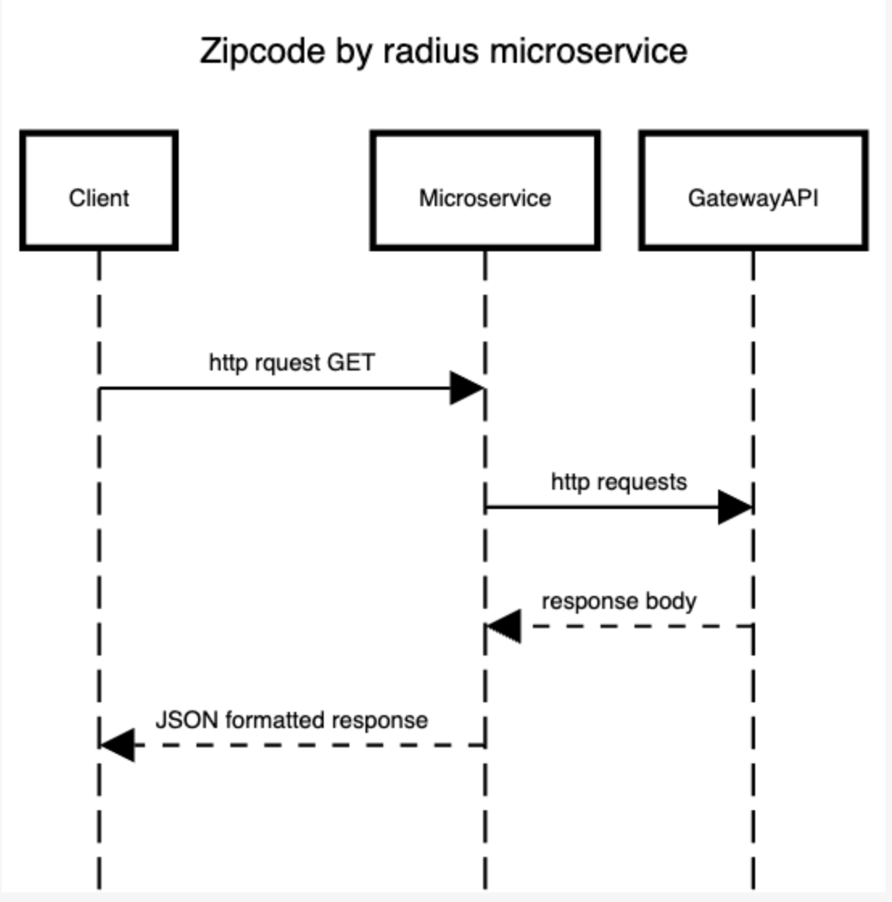

How to make a request call:

http method: GET
@code -> zip code that you are checking
@radius -> radius from the centre of the located zip code
@country -> country of the zip code belongs to

url = https://zipcodemicroservice.herokuapp.com/zipcode?code={@code}&radius={@radius}&country={@country}

How to receive the data:

Data will be received as JSON format

Example call:

GET https://zipcodemicroservice.herokuapp.com/zipcode?code=10005&radius=0.1&country=us

Returned body:
{
    "query": {
        "code": "10005",
        "unit": "km",
        "radius": "0.1",
        "country": "us"
    },
    "results": [
        {
            "code": "10005",
            "city": "New York",
            "state": "NY",
            "city_en": null,
            "state_en": null,
            "distance": 0
        }
    ]
}

